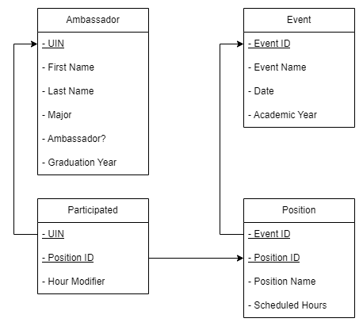
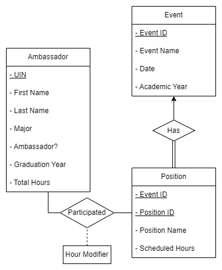

# Ambassador-Database-Application
The purpose of this repository is to store code for an engineering ambassador database application created as a project for Intro to Data Engineering (COP 3710) during the Spring 2023 semester.

# Requirements
- Stricter requirements than usual because of controlled information
- Working with a pre-existing information source (Ambassador Hours Spreadsheet)
- Identify students via their UIN (no need to track exact email)
- Need to track graduation year, ambassador status, and total hours

# Schema Diagram

# Entity-Relationship (ER) Diagram 

# Tables
- Ambassador 
   - **UIN** (primary)
   - First Name
   - Last Name
   - Major
   - Graduation Year
   - Ambassador Status
- Participated 
   - **UIN** (primary, foreign)
   - **Position ID** (primary, foreign)
   - Hour Modifier
- Position 
   - **Event ID** (primary, foreign)
   - **Position ID** (primary)
   - Position Name
   - Scheduled Hours
- Event 
   - **Event ID** (primary)
   - Event Name
   - Date
   - Academic Year

<!-- ## Pending Changes
- [x] Ambassador table needs "graduation year" integer attribute
- [x] Create Views
   - View for Ambassadors (name, major, total hours, ambassador status) 
   - View for Events (event, hours, positions in a list in one column)
   - View for Positions (name, UIN, position name, event, hours)
 - [x] Write "insert into" table statements with fake data 
   - Maybe 5-6 fake ambassadors with different values -->

## Inserts
- Insert new ambassador
- Insert new event
- Insert new position given an event
- Insert new record for ambassador participating in an event

## Updates
- Update hour modifier given an ambassador and position
- For a given ambassador:
    - Update name
    - Update major
    - Update ambassador status
    - Update graduation year
- For a given position:
    - Update scheduled hours

## Deletes
- Delete an ambassador
- Delete an event and associated positions
- Delete all ambassadors who graduated before a given year
- Delete all events with no participation records
- Delete all events with no participation records before a given year

## Queries
- For all ambassadors:
    - All ambassadors graduating in a given year
    - All ambassadors of a given major
- Given a specific ambassador:
    - An ambassador's information (UIN, major, graduation year, ambassador status)
    - An ambassador's hour count for a given year
    - An ambassador's cumulative record of positions/events
- Given a specific event:
    - List of ambassadors and their respective positions at the event
    - List of ambassadors in a given position at the event
  
# Application Information
- Application-side constraints for ambassador input
- In the future, functionality will be added to edit positons/hours/events/etc.

# Challenges
- Stricter security requirements (sensitive student information)
- GUI library (PyQt6) not exactly developer-friendly
- No good documentation for PyQt6 (only PyQt5)
- No existing template/resources to translate spreadsheet into new model

# Future Work
- Will likely transition this prototype to an Accesss Database
   - For both security and functionality
- For this GUI, could add more buttons for views and editing
   - Possibly a search functionality
